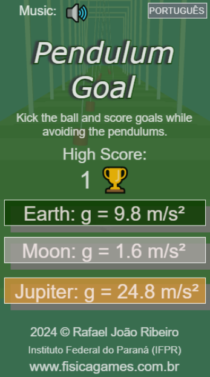
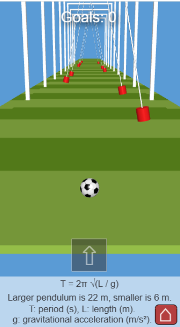

# Pendulum Game

## Descrição

**Pendulum Game** é um jogo interativo que permite aos jogadores explorar o comportamento físico dos pêndulos em diferentes planetas. O objetivo é desviar dos pêndulos que balançam de acordo com a gravidade de cada fase (Terra, Lua e Júpiter). Além de ser uma experiência divertida, o jogo também ensina conceitos de física, como a relação entre o período e o comprimento do pêndulo, com base na gravidade de cada ambiente.

## Funcionalidades

* O jogador controla uma bola que deve desviar de pêndulos em um jogo estilo "runner".
* Três fases estão disponíveis, com diferentes gravidades: Terra (g = 9.8 m/s²), Lua (g = 1.6 m/s²) e Júpiter (g = 24.8 m/s²).
* Cada fase tem séries de pêndulos altos e baixos, permitindo observar a relação entre o comprimento do pêndulo e o seu período de oscilação.
* Frases com conceitos físicos relacionados ao movimento dos pêndulos são apresentadas ao final de cada fase.
* O jogo é totalmente controlado por um único botão na tela (para chutar a bola), visando um design de interação simples e acessível para todos.

## Tecnologias Utilizadas

* **TypeScript** : Linguagem de programação.
* **Babylon.js** : Motor gráfico para a renderização 3D.
* **Havok** : Motor de física (para interações físicas realistas).
* **Vite.js** : Ferramenta para build e desenvolvimento.
* **VS Code** : Editor de código.
* **GitHub** : Plataforma para controle de versão e colaboração.
* **Arquitetura MVC** : Utilizada para organizar o código com eventos baseados em callbacks.

## Instalação

1. **Pré-requisitos** :

* Node.js
* Babylon.js
* Havok
* Vite.js

1. **Instalação** :
   Clone o repositório ou copie o código para o seu ambiente local.
   No terminal, execute:

<pre class="!overflow-visible">

bash

<button class="flex gap-1 items-center select-none py-1"><svg width="24" height="24" viewBox="0 0 24 24" fill="none" xmlns="http://www.w3.org/2000/svg" class="icon-sm"><path fill-rule="evenodd" clip-rule="evenodd" d="M7 5C7 3.34315 8.34315 2 10 2H19C20.6569 2 22 3.34315 22 5V14C22 15.6569 20.6569 17 19 17H17V19C17 20.6569 15.6569 22 14 22H5C3.34315 22 2 20.6569 2 19V10C2 8.34315 3.34315 7 5 7H7V5ZM9 7H14C15.6569 7 17 8.34315 17 10V15H19C19.5523 15 20 14.5523 20 14V5C20 4.44772 19.5523 4 19 4H10C9.44772 4 9 4.44772 9 5V7ZM5 9C4.44772 9 4 9.44772 4 10V19C4 19.5523 4.44772 20 5 20H14C14.5523 20 15 19.5523 15 19V10C15 9.44772 14.5523 9 14 9H5Z" fill="currentColor"></path></svg>Copiar código</button>

<code class="!whitespace-pre hljs language-bash">npm install
   </code>

</pre>

1. **Rodando o projeto localmente** :
   Para iniciar o servidor de desenvolvimento:

<pre class="!overflow-visible">

bash

<button class="flex gap-1 items-center select-none py-1"><svg width="24" height="24" viewBox="0 0 24 24" fill="none" xmlns="http://www.w3.org/2000/svg" class="icon-sm"><path fill-rule="evenodd" clip-rule="evenodd" d="M7 5C7 3.34315 8.34315 2 10 2H19C20.6569 2 22 3.34315 22 5V14C22 15.6569 20.6569 17 19 17H17V19C17 20.6569 15.6569 22 14 22H5C3.34315 22 2 20.6569 2 19V10C2 8.34315 3.34315 7 5 7H7V5ZM9 7H14C15.6569 7 17 8.34315 17 10V15H19C19.5523 15 20 14.5523 20 14V5C20 4.44772 19.5523 4 19 4H10C9.44772 4 9 4.44772 9 5V7ZM5 9C4.44772 9 4 9.44772 4 10V19C4 19.5523 4.44772 20 5 20H14C14.5523 20 15 19.5523 15 19V10C15 9.44772 14.5523 9 14 9H5Z" fill="currentColor"></path></svg>Copiar código</button>

<code class="!whitespace-pre hljs language-bash">npm run dev
   </code>

</pre>

   Para gerar os arquivos de distribuição:

<pre class="!overflow-visible">

bash

<button class="flex gap-1 items-center select-none py-1"><svg width="24" height="24" viewBox="0 0 24 24" fill="none" xmlns="http://www.w3.org/2000/svg" class="icon-sm"><path fill-rule="evenodd" clip-rule="evenodd" d="M7 5C7 3.34315 8.34315 2 10 2H19C20.6569 2 22 3.34315 22 5V14C22 15.6569 20.6569 17 19 17H17V19C17 20.6569 15.6569 22 14 22H5C3.34315 22 2 20.6569 2 19V10C2 8.34315 3.34315 7 5 7H7V5ZM9 7H14C15.6569 7 17 8.34315 17 10V15H19C19.5523 15 20 14.5523 20 14V5C20 4.44772 19.5523 4 19 4H10C9.44772 4 9 4.44772 9 5V7ZM5 9C4.44772 9 4 9.44772 4 10V19C4 19.5523 4.44772 20 5 20H14C14.5523 20 15 19.5523 15 19V10C15 9.44772 14.5523 9 14 9H5Z" fill="currentColor"></path></svg>Copiar código</button>

<code class="!whitespace-pre hljs language-bash">npm run build
   </code>

</pre>

## Como Jogar

1. **Objetivo** : Evitar os pêndulos enquanto tenta marcar gols.
2. **Controles** : O jogo é controlado por um único botão para chutar a bola.
3. **Gravidade** : O jogo oferece três fases diferentes com gravidades variadas:

* **Terra** : g = 9.8 m/s²
* **Lua** : g = 1.6 m/s²
* **Júpiter** : g = 24.8 m/s²

1. **Alterar Idioma** : Você pode mudar entre os idiomas **Português** e **Inglês** clicando no botão no canto superior direito.

Jogue e aprenda mais sobre a física dos pêndulos!

## Telas do Jogo

  

## Contribuindo

Este projeto ainda está privado. No entanto, se você deseja contribuir, fique à vontade para seguir os seguintes passos quando o repositório for aberto:

1. Clone o repositório.
2. Crie uma nova branch:
   <pre class="!overflow-visible">

bash

<button class="flex gap-1 items-center select-none py-1"><svg width="24" height="24" viewBox="0 0 24 24" fill="none" xmlns="http://www.w3.org/2000/svg" class="icon-sm"><path fill-rule="evenodd" clip-rule="evenodd" d="M7 5C7 3.34315 8.34315 2 10 2H19C20.6569 2 22 3.34315 22 5V14C22 15.6569 20.6569 17 19 17H17V19C17 20.6569 15.6569 22 14 22H5C3.34315 22 2 20.6569 2 19V10C2 8.34315 3.34315 7 5 7H7V5ZM9 7H14C15.6569 7 17 8.34315 17 10V15H19C19.5523 15 20 14.5523 20 14V5C20 4.44772 19.5523 4 19 4H10C9.44772 4 9 4.44772 9 5V7ZM5 9C4.44772 9 4 9.44772 4 10V19C4 19.5523 4.44772 20 5 20H14C14.5523 20 15 19.5523 15 19V10C15 9.44772 14.5523 9 14 9H5Z" fill="currentColor"></path></svg>Copiar código</button>

<code class="!whitespace-pre hljs language-bash">git checkout -b nome-da-sua-branch
   </code>

</pre>
3. Realize as alterações.
4. Envie um pull request para revisão.

## Licença

Este projeto é protegido por direitos autorais e está sob  **licença proprietária** . Não está disponível para distribuição, modificação ou uso comercial sem a permissão explícita do autor.

**Copyright** (c) 2024 Rafael João Ribeiro.

### Aviso sobre Bibliotecas de Terceiros

Este projeto utiliza as seguintes bibliotecas de terceiros, cujas licenças devem ser respeitadas:

* **Babylon.js** : Licenciado sob a [Licença Apache 2.0](https://www.apache.org/licenses/LICENSE-2.0).
* **Havok** : Licenciado conforme os termos do fornecedor.
* **Vite.js** : Licenciado sob a [Licença MIT]().

Certifique-se de consultar as licenças de bibliotecas de terceiros para garantir conformidade com os termos de uso.

Por enquanto, este projeto não está disponível com uma licença pública.

## Autor

Este projeto foi desenvolvido por:

* **Prof. Dr. Rafael João Ribeiro**
  Instituto Federal do Paraná (IFPR)
  [www.fisicagames.com.br](https://www.fisicagames.com.br)
